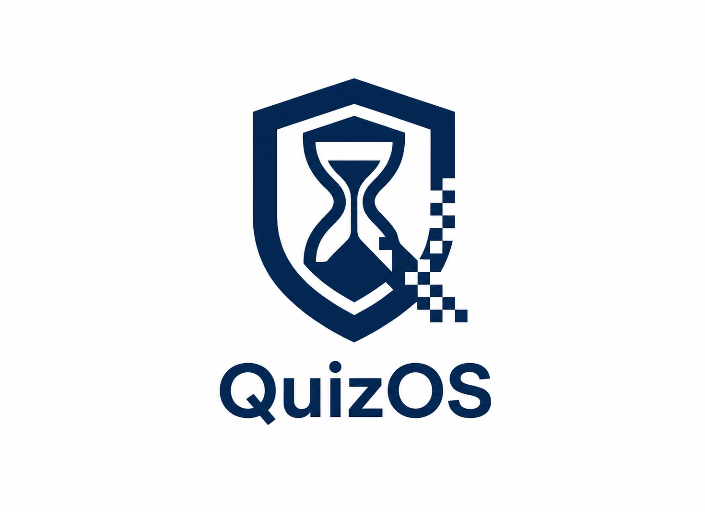

<div align="center">



# Mmuta

**Teach. Test. Trust.**

The complete exam and learning platform for Nigerian schools.

[](https://www.typescriptlang.org/)
[](https://react.dev/)
[](https://expressjs.com/)
[](https://www.prisma.io/)
[](https://vercel.com/)

</div>

---

## What Is Mmuta?

Mmuta (Igbo: *ịmụta* — to learn, to come to know) is a full-stack academic operating system built for Nigerian schools. It handles the complete lifecycle of teaching and assessment: from a lecturer uploading notes and creating a quiz, to a student sitting a time-boxed CBT exam with anti-cheat enforcement, through to AI-assisted grading, live video lectures, and results.

**Mmuta Exams** — the CBT engine. Timed, proctored, anti-cheat, AI-graded.  
**Mmuta Live** — live video lectures with slides, polls, hand-raise queue, and attendance.  
**Mmuta Results** — gradebook, analytics, and printable grade reports.

One codebase. One deployment. Every school tool in one place.

---

## Features

### For Students

| Tab | What it does |
|-----|-------------|
| **Notes** | Read lecturer-uploaded course notes with full Markdown + LaTeX math rendering |
| **Quizzes** | Take time-boxed MCQ assessments in a secure exam engine |
| **Exams** | Submit written theory exams; AI grades against the answer key |
| **Assignments** | Submit assignments with text or file uploads; AI-assisted grading |
| **Live Classroom** | Join live video lectures (Jitsi); raise hand to request the mic |
| **History** | View all past attempts, scores, and per-question answer breakdowns |
| **Calendar** | Upcoming quizzes, exams, and assignment deadlines |
| **Discussions** | Course-scoped discussion board with thread replies |

### For Lecturers

| Tab | What it does |
|-----|-------------|
| **Gradebook** | All student submissions in one view — filter by course, export CSV |
| **Courses** | Create and manage courses per department and year level |
| **Notes** | Upload lecture notes via .docx or direct markdown editor |
| **Quizzes** | Create MCQ quizzes; AI generates questions from pasted text or uploaded file |
| **Exams** | Upload theory exam PDFs; AI grades against a structured answer key |
| **Assignments** | Create and manage assignments; AI assists with grading |
| **Live Lecture** | Start live video session with slide sharing (.pptx), polls, hand-raise queue, chat, and attendance capture |
| **Analytics** | Score distribution charts, per-question success rates, class-wide pass/fail breakdown |
| **Announcements** | Send push notifications to all students (Web Push / PWA) |
| **Departments** | Manage departments and student enrollment |
| **Calendar** | Schedule and view all assessments |
| **Discussions** | Moderate course discussions; pin important threads |

### Exam Security

The CBT engine mirrors an invigilated exam hall:

- **Tab-switch detection** — 3-strike system; third violation auto-submits and locks the session
- **Fullscreen enforcement** — leaving fullscreen counts as a violation
- **Question randomisation** — questions are shuffled per session
- **Server-side timer** — client and server clocks sync every 10 seconds; server is source of truth
- **Auto-submit on timeout** — session is locked and scored server-side when time expires
- **Answers auto-saved** — written to localStorage on every change; survives network drops
- **Copy-protection overlay** — student watermark rendered across the exam surface
- **Offline recovery banner** — notifies student when network drops; confirms answers are safe

---

## Tech Stack

| Layer | Technology |
|-------|-----------|
| Frontend | React 19, TypeScript, Tailwind CSS v4, Framer Motion |
| Backend | Express.js 4, Node.js, TypeScript |
| Database | Prisma ORM → Turso (libSQL / SQLite edge) |
| Auth | JWT (jsonwebtoken) + bcrypt |
| Real-time | WebRTC (live audio) + Ably Realtime (signaling + presence) |
| Video lectures | Jitsi Meet (embedded) |
| AI features | Gemini + OpenAI — question generation, essay grading, lecture summarisation |
| File parsing | Mammoth (.docx → HTML), JSZip (.pptx slide extraction) |
| Math rendering | KaTeX via remark-math + rehype-katex |
| Push notifications | Web Push (VAPID) |
| PWA | Service Worker (cache-first for assets, network-first for API) |
| Deployment | Vercel (serverless functions + static frontend) |

---

## Local Setup

### Prerequisites

- Node.js 18+
- A [Turso](https://turso.tech) database (free tier works)
- An [Ably](https://ably.com) account (free tier, no credit card)

### Steps

```bash
# 1. Clone and install
git clone https://github.com/mimisco-git/Mmuta.git
cd Mmuta
npm install

# 2. Copy the env template
cp .env.example .env

# 3. Fill in your values (see table below)
npm run dev
```

The app runs at `http://localhost:3000`. Backend and frontend are served from the same Express process in development.

---

## Environment Variables

```env
# Database - Turso
DATABASE_URL=libsql://your-db-name.turso.io
TURSO_AUTH_TOKEN=your-turso-auth-token

# Auth
JWT_SECRET=your-64-character-hex-secret

# Real-time (Ably)
ABLY_API_KEY=your-ably-api-key

# AI grading/generation - optional
NVIDIA_API_KEY=your-nvidia-nim-key

# Push notifications - optional
VAPID_PUBLIC_KEY=your-vapid-public-key
VAPID_PRIVATE_KEY=your-vapid-private-key
VAPID_EMAIL=admin@yourdomain.com
```

| Variable | Required | How to get it |
|----------|----------|---------------|
| `DATABASE_URL` | Yes | [turso.tech](https://turso.tech) → create database → copy URL |
| `TURSO_AUTH_TOKEN` | Yes | Turso dashboard → generate token |
| `JWT_SECRET` | Yes | `openssl rand -hex 32` |
| `ABLY_API_KEY` | Yes (audio) | [ably.com](https://ably.com) → API Keys → Root key |
| `NVIDIA_API_KEY` | No | [build.nvidia.com](https://build.nvidia.com) → API Keys |
| `VAPID_*` | No | `npx web-push generate-vapid-keys` |

For **Vercel deployment**, add all variables under Settings → Environment Variables.

---

## Project Structure

```
Mmuta/
├── src/
│   ├── components/
│   │   ├── LandingScreen.tsx      # Login / boot screen
│   │   ├── StudentDashboard.tsx   # Full student portal (8 tabs + secure exam engine)
│   │   ├── LecturerDashboard.tsx  # Full lecturer portal (12 tabs)
│   │   ├── LiveAudioRoom.tsx      # WebRTC + Ably audio room
│   │   ├── SlideView.tsx          # Fullscreen slide presentation
│   │   ├── SecureContent.tsx      # Watermark overlay for exam content
│   │   └── ...
│   ├── lib/
│   │   ├── db.ts                  # Prisma client (Turso adapter)
│   │   └── seed.ts                # Initial department seeding
│   ├── types.ts
│   └── App.tsx
├── server.ts                      # Express API (3900+ lines)
├── api/index.ts                   # Vercel serverless entry point
├── prisma/schema.prisma           # Database schema
├── public/
│   ├── sw.js                      # Service Worker
│   └── manifest.json              # PWA manifest
├── vercel.json
└── vite.config.ts
```

---

## Scripts

| Command | What it does |
|---------|-------------|
| `npm run dev` | Start development server |
| `npm run build` | Build frontend + backend for production |
| `npm run lint` | TypeScript type check |
| `npm start` | Run the production build locally |

---

## Deployment

This project is configured for **Vercel** out of the box:

1. Push to GitHub
2. Import the repo in Vercel
3. Add all environment variables under Settings → Environment Variables
4. Deploy — Vercel runs `npm run vercel-build` (`prisma generate && vite build`) automatically

---

## License

MIT © 2026 Mmuta
